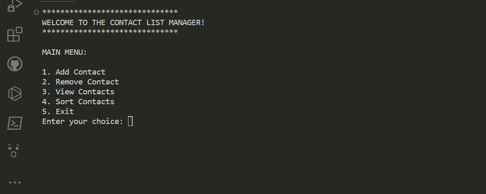
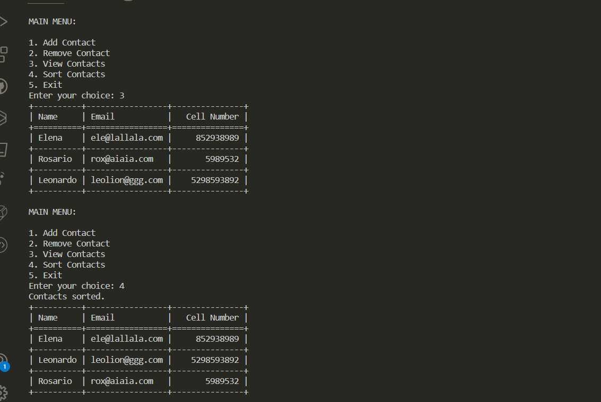

# Contact List Manager

This Contact List Manager is a Python project developed as part of my portfolio. It allows users to manage their contacts efficiently. The application provides functionalities to add, remove, view, and sort contacts. Contacts are saved to a text file for persistence, ensuring that users can access their contacts even after closing the program.

## Project Overview

- Developed using Python programming language.
- Utilizes object-oriented programming concepts.
- Implements file I/O operations for saving and loading contacts.
- Utilizes the tabulate library for displaying contacts in a tabulated format.
- Provides a simple and intuitive command-line interface for user interaction.

## Development Setup

- I used VS Code to write the code and manage the project.
- To keep things tidy and organized, I worked in a virtual environment: it helped me manage dependencies and keep everything running smoothly.

## Usage

- Just run the `main.py` script to get started.
- Then, you can choose from a menu of options to do whatever you need with your contacts.
- Your contacts will be saved automatically to a file named `contacts.txt`.

## About

This project was created after completing lessons from HyperionDev as part of my Python learning journey. It's been a great way for me to practice my skills and learn more about handling files and data.

I'm always open to feedback and ideas to make this project even better!

